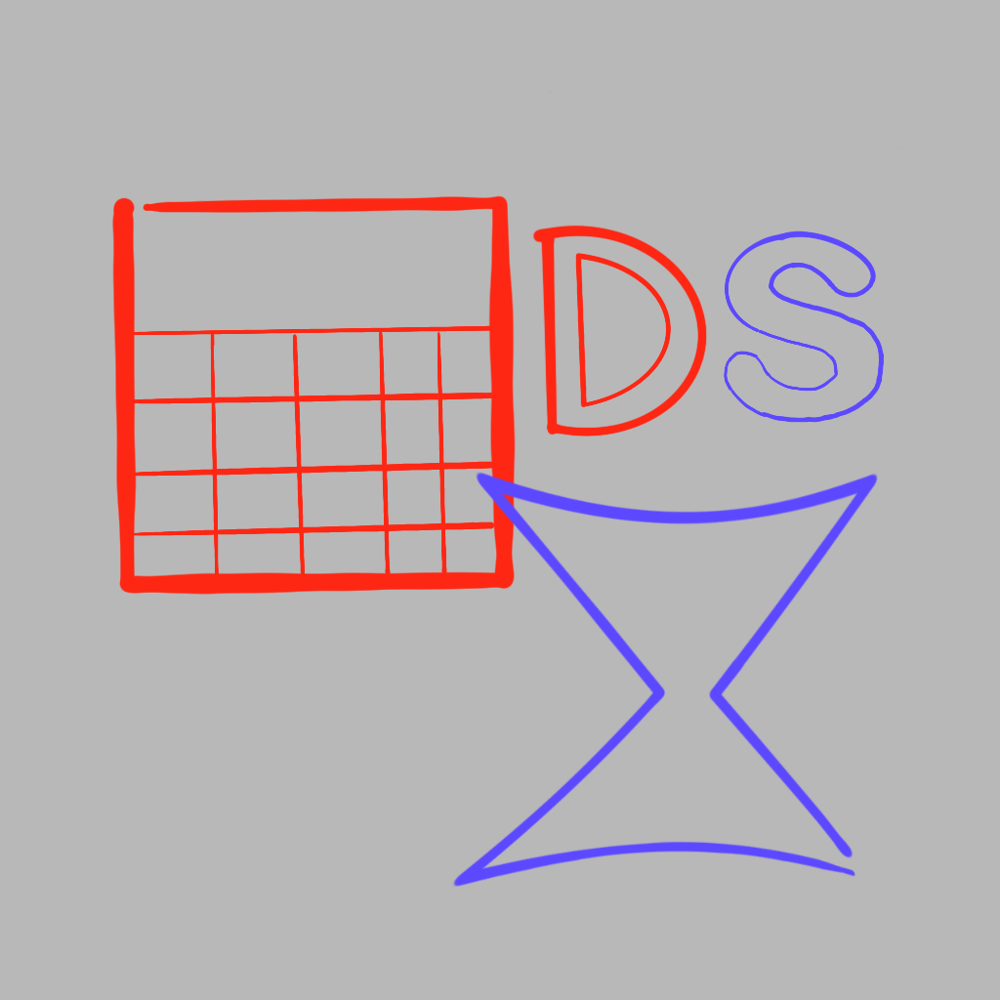
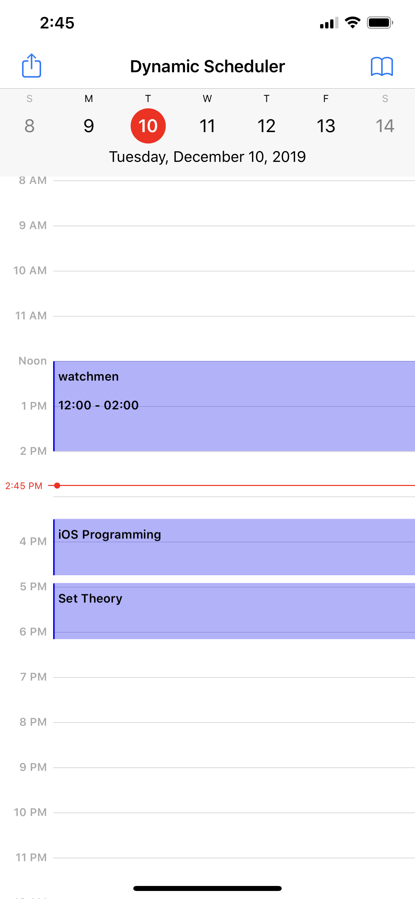

# Dynamic Scheduler

By Cameron Stowell and Noah Brumfield

# Overview

Dynamic Scheduler is a Swift app that allows a user to import their existing iOS calendar and schedule your upcoming work. By giving the app the constraints you want to work under, it will schedule time in your calendar for you to work on each task and get it done on time. 

This project uses [CalendarKit](https://github.com/richardtop/CalendarKit)

# Instructions

## To build

Clone the repo and build in XCode using the old build system. The project should be configured correctly with CocoaPods already. This project uses the "CalendarKit" pod and its dependencies.

## To use

1. The prompt for a calendar input will only show up on a fresh install. NOTE: It will only import a calendar named "Classes". This can be changed by hardcoding a different calendar name into the **importCalendar()** function in **CalendarImporter**.

2. The top-right button on the CalendarView will bring you to the Projects view. From here, you can add a new Project by name.

3. Tap your project's name to go a to a list of it's task. Here you can add a new task.

4. Give your task a name, start/due date, and estimated length, how long you can stand to work on it in one sitting, the earliest time in the day you are willing to work on it, and any additional notes. 

5. Hit add and go look at the calendar! Your task has been scheduled. If there isn't enough time to complete the task, it will not let you save it. 

# Views

## Initial Set-up (CalendarImporterView)

For our prototype delivered as the final project, the Initial Set-up has become an alert that is triggered by the first ever launch of the app. It does not yet support Google imports. Also, since it has become a single alert as opposed to its own view, it does not have the interface to import specific constraints or calendars. Instead, it defaults to importing the &quot;Classes&quot; calendar from the built-in iOS calendar.

## CalendarViewController

**CalendarViewController** is implemented using the **CalendarKit** framework and acts as the home screen for our app. From here, users will be able to see their existing scheduled work and have the ability to create more Projects and Tasks that will automatically populate the calendar with events. In our prototype, it is where the user is prompted to import their iOS calendar. There is currently no functionality for switching between different ways of viewing the calendar.

#### viewDidLoad()

Programmatically builds the buttons for the view&#39;s navigation bar, and prompts the user to import their calendar if they have not yet been asked.

#### eventsForDate(\_ date: Date)->[EventDescriptor]

A delegate function from the **DayViewController** in **CalendarKit** , implemented to fetch all **EventData** objects from Core Data with dates matching the argument passed to the function and returns them as a set of **EventDescriptor** , which is the proprietary object structure **CalendarKit** uses to interface with its calendar.

#### hasBeenPromptedForImport()->Bool

Keeps track of a variable in **UserDefaults** that denotes whether or not the user has been prompted for imported before. If they have not been prompted, then we can assume they are about to be, and the variable is set to true.

#### promptForImport()

Creates a **UIAlertController** that asks users if they want to import their existing iOS calendar. If they say yes, a **CalendarImporter** object is instantiated and used to import the user&#39;s calendar.

## AddTaskViewController

The view used for adding a new task to a project. Accessed by going through the **ProjectTableViewController** and selecting a particular project. Contains fields for adding a **name** , **start date** , **due date** , **estimated time to complete the task** , **notes about the task** , and **an attention span** for the task. The view controller also has variables that are references to the app&#39;s Core Data **NSManagedObjectContext** , the **Project** in Core Data associated with this task, and a **DateFormatter** used to format entered dates correctly. The fields for entering dates open up a **UIDatePicker** instead of a keyboard, which is done programmatically.

#### viewDidLoad()

Used to initialize the **DateFormatter** , a border around the **UITextView** for entering notes about the task, and for recognizing a tap gesture that allows the user to dismiss the keyboard when they are done entering information.

## ProjectTableViewController

Implements a **UITableView** that lists all the ongoing projects that a user has stored in the app&#39;s Core Data. When a cell in the table is selected, the app goes to a **ProjectTasksViewController** for that project.

## ProjectTasksViewController

Accessed from the **ProjectTableViewController**. Lists all the tasks for the selected project. Has a button that allows users to create new tasks for the project, which is done by sending them to the **AddTaskViewController**.

## GenericTaskViewController

# Core Data Entities

## Project

Simply a collection of tasks made up of a name string and relationships to the tasks that fall under the project. In our prototype, we model **Projects** using classes for school.

## Task

Tasks are the pieces of work that make up a project. When entered, they require a parent **Project** to be associated with. Creating a new task requires user entry of information that can be used to then automatically schedule time to perform the task on the calendar.

## EventData

**EventData** entities store all the information needed to create an event instance on the calendar. Tasks and Constraints are related to many **EventData** objects, which represent the blocks of time that a life constraint or working on a task take up. Additionally, the imported user calendar is stored in the form of EventData objects.

# Custom Swift Classes

## TaskScheduler

**TaskScheduler** is a class that is initialized with a reference to a **Task** from our Core Data model and the **NSManagedObjectContext** that our Core Data session is using.

#### schedule()->Bool

Attempts to schedule enough events to work on completing the task before its due date. If not possible by the current algorithm, the function returns false. The algorithm fetches all **EventData** objects from Core Data on dates that the task can be worked on and looks for enough free time between existing events to work on the task. The algorithm prioritizes getting work down as soon as possible.

## CalendarImporter

**CalendarImporter** is a class written for **Dynamic Scheduler** that allows us to request permission from the user to access their pre-existing calendars and import the data from them. Currently, it only supports iOS imports and has to be hard-coded to choose which calendars to import. Future versions of CalendarImporter would come with its own view in the initial set-up that allows for importing specific existing calendars without having to match the hard coded names in the source code.

#### importCalendar()

If the app has permission to access the user&#39;s calendar, this function pulls in all events and creates new **EventData** objects in the app&#39;s Core Data to represent them. This is called when the user is prompted at their first launch to import their existing calendar and selects &quot;yes&quot;.

#### requestCalendarAccess()

Called by **importCalendar()**, performs the system calls needed to request permission from the user to access their calendar.

# Who Did What?

## Cameron
* CalendarView
* Scheduling
* UX tweaks

## Noah
* Every other view
* Navigation between views
* UI

## Cameron/Noah
* CoreDate integration
* AddTaskView
* Documentation

# Possible Future Features
* An initial set-up view that allows users for more choice in what calendars they import, and support for Google calendar
* Detailed statistics on the amount of work performed over a period of time
* Suggestions for length of future work based of past work statistics
* A UI overhaul to make the app prettier
* More robust constraint that allows for more than "Start/Due date", "Attention Span", and "Earliest Time"

